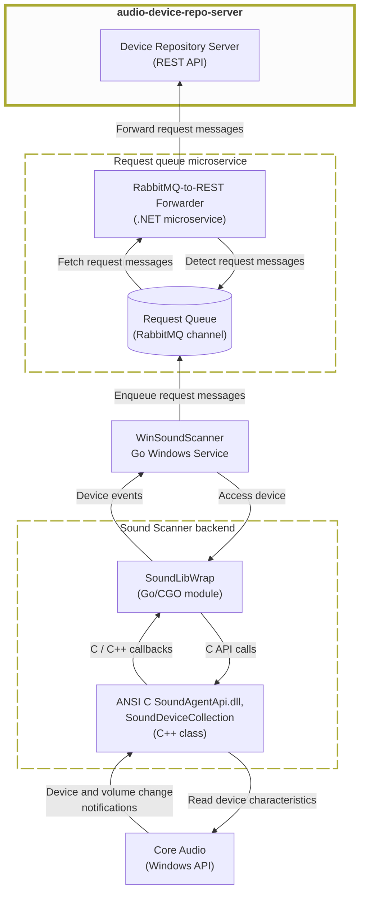

# audio-device-repo-server (Audio Device Repository Server, AudioDeviceRepoServer)

Audio Device Repository Server is a ASP.NET-Core-with REST-API-backend for storing and serving sound device data.

## Architecture

<div style="zoom: 0.5;">


</div>

## Functions

- Exposes a REST API for audio device messages and queries.
- Persists and reads audio device data in MongoDB.
- Receives forwarded request messages from the RabbitMQ-to-REST forwarder.
- Serves the backend used by the React client.
- API details: [rest-api-documentation.md](DeviceRepoAspNetCore/rest-api-documentation.md)

## Technologies Used

- C# with .NET 8 (ASP.NET Core).
- MongoDB via `MongoDB.Driver`.
- Razor Pages and REST controllers.
- NUnit and Moq for automated tests.
- Postman collection for API checks.
- LibMan for client-side web assets.

## Build and Debug

### Prerequisites

- .NET SDK 8.0
- LibMan CLI installed

### Build

```powershell
git submodule update --init --recursive
dotnet tool install -g Microsoft.Web.LibraryManager.Cli
dotnet restore
dotnet build
```

### Run and Debug

```powershell
cd DeviceRepoAspNetCore
dotnet run --launch-profile http
```

- HTTP profile uses `http://localhost:5027`.
- Set breakpoints and start `DeviceRepoAspNetCore` in your IDE (Rider or Visual Studio).

### Tests

```powershell
dotnet test
```

Optional smoke host:

```powershell
dotnet run --project .\DeviceController.SmokeHost\DeviceController.SmokeHost.csproj --launch-profile http
```

## Used design patterns (excluding framework-provided ones)

- Repository: `Services\IAudioDeviceStorage` and `Services\MongoDbAudioDeviceStorage` abstract and
  encapsulate MongoDB persistence behind an interface.

- DTO (data transfer object): `Models\RestApi\EntireDeviceMessage` and `Models\RestApi\VolumeChangeMessage`
  defineAPI payloads separate from persistence models.

- Adapter/Mapper: `Models\MongoDb\AudioDeviceDocument.ToDeviceMessage()`
  converts MongoDB documents to REST DTOs.

- Specification (via custom validation attribute): `Models\RestApi\AllowedDeviceMessageTypesAttribute`
  constrains allowed `DeviceMessageType` values on models.

## Changelog

- 2026-02-12 Updated `LICENSE` and `README` metadata.
- 2026-01-28 Updated launch settings to localhost URLs.
- 2026-01-23 Added controller tests against a real MongoDB backend.
- 2026-01-22 Moved MongoDB settings and storage to `DeviceControllerLib`.
- 2026-01-15 Extracted shared controller/models/interfaces to `DeviceControllerLib` and added `DeviceController.SmokeHost`.

## License

This project is licensed under the terms of the [MIT License](LICENSE).

## Contact

Eduard Danziger

Email: [edanziger@gmx.de](mailto:edanziger@gmx.de)
